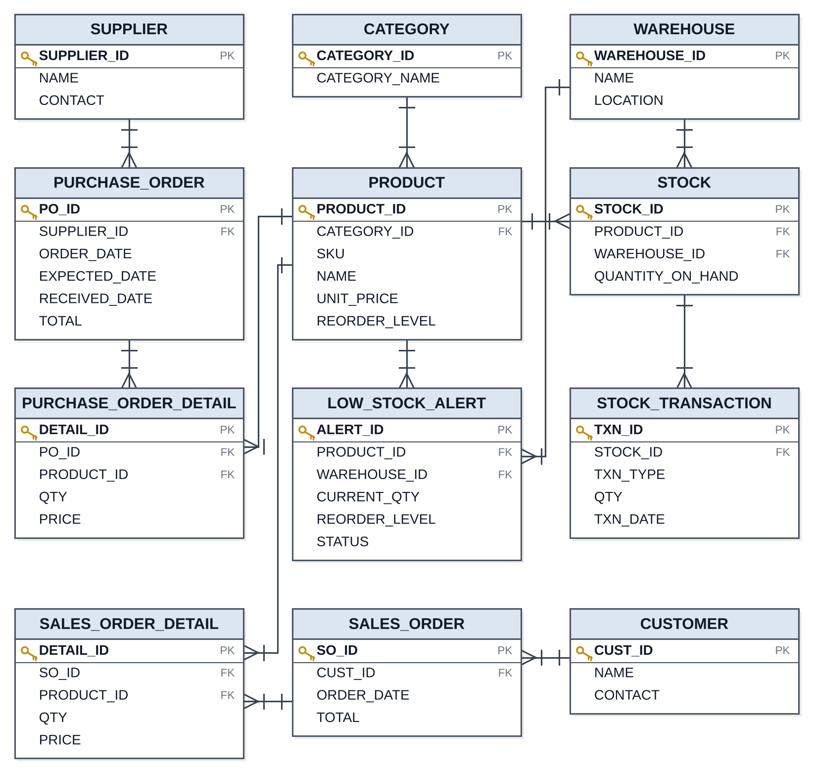

# Supply Chain & Inventory Management System (Oracle PL/SQL)

A full-scale inventory and supply-chain database system built in Oracle, covering the complete lifecycle of raw material tracking from supplier onboarding and warehouse stock levels to automated low-stock alerts, purchase/sales order processing, and business analytics.

Built as a hands-on project to practice production-grade Oracle database design: normalized schema, large-scale data generation (1,000,000+ transaction rows), sequences, indexing and performance tuning, triggers, functions, procedures, a PL/SQL package with concurrency control, cursors, views, and complex analytical joins.

---

## Overview

Real-world supply chain systems need to answer questions like: *How much stock do we have right now? What's about to run out? Which supplier should we reorder from? Are two people about to oversell the same batch of stock?*

This project models that entire flow inside a single Oracle schema (`HRDB`), split into 12 sequential development phases from raw schema design through to tested, concurrency-safe business logic and reporting.

## Tech Stack

- **Database:** Oracle Database (SQL, PL/SQL)
- **Tooling:** Oracle SQL Developer
- **Core Oracle features used:** `IDENTITY` columns, `SEQUENCE`, B-tree indexes, `TRIGGER`, `FUNCTION`, `PROCEDURE`, `PACKAGE`/`PACKAGE BODY`, explicit `CURSOR`, `VIEW`, window functions (`RANK() OVER`), `DBMS_RANDOM`, `DBMS_STATS`, `EXPLAIN PLAN`

---

## Database Schema

12 tables, fully normalized with foreign keys:



| Table | Purpose |
|---|---|
| `CATEGORY` | Product classification |
| `WAREHOUSE` | Physical storage locations |
| `SUPPLIER` | Raw material vendors |
| `PRODUCT` | Items/materials being tracked (SKU, reorder thresholds) |
| `CUSTOMER` | Distributors/retailers/wholesalers |
| `STOCK` | **Current** quantity on hand — one row per product × warehouse |
| `STOCK_TRANSACTION` | **Historical log** of every stock movement (IN/OUT/ADJUST) — 1,000,000+ rows |
| `PURCHASE_ORDER` / `PURCHASE_ORDER_DETAIL` | Orders placed with suppliers |
| `SALES_ORDER` / `SALES_ORDER_DETAIL` | Orders fulfilled for customers |
| `LOW_STOCK_ALERT` | Auto-generated alerts when stock drops below reorder level |

**Key design decision:** `STOCK` (current state) is kept separate from `STOCK_TRANSACTION` (append-only history) — the current-state table is always small and fast to query, while the full movement history is preserved independently for auditing and trend analysis.

---

## Data Volume

| Table | Rows | Generation Method |
|---|---|---|
| Category | 10 | Static inserts |
| Warehouse | 5 | Static inserts |
| Supplier | 80 | PL/SQL loop, randomized |
| Product | 600 | PL/SQL loop, randomized (FK-safe via `BULK COLLECT`) |
| Customer | 300 | PL/SQL loop, randomized |
| Stock | 3,000 | Cross join (600 products × 5 warehouses) |
| **Stock Transaction** | **1,000,000** | Set-based generation: two 1,000-row `CONNECT BY LEVEL` generators cross-joined, with `DBMS_RANDOM` values computed per row |
| Purchase Orders (+ line items) | 2,000 (+ ~5,000) | PL/SQL loop using `RETURNING INTO` |
| Sales Orders (+ line items) | 5,000 (+ ~12,500) | PL/SQL loop using `RETURNING INTO` |

All data is randomized per row (not duplicated single-value fills) — validated with `GROUP BY ... HAVING COUNT(*) > n` checks to confirm variety across the dataset.

---

## Project Phases

The build was done in 12 incremental phases, each in its own script:

1. **Schema Design** — 12 tables, primary/foreign keys, `IDENTITY` surrogate keys
2. **Master Data + Bulk Generation** — realistic randomized data, including the 1M-row transaction log
3. **Sequences** — `PO_NUMBER_SEQ` / `SO_NUMBER_SEQ` generate human-readable business document numbers (e.g. `PO-1001`), separate from internal surrogate IDs
4. **Indexing & Performance** — composite indexes on high-traffic filter columns; verified with `EXPLAIN PLAN` (`INDEX RANGE SCAN` vs `TABLE ACCESS FULL`) and `DBMS_STATS`
5. **Trigger** — `TRG_LOW_STOCK_ALERT` fires on every stock update; auto-creates an alert when quantity drops below the reorder threshold, and auto-resolves it once restocked
6. **Functions** — reusable calculations: current stock value, average daily consumption, days-of-supply-remaining
7. **Procedures** — one per table for master-data management, plus order-processing procedures (`PROC_ADD_SO_DETAIL` updates three tables in one call: order line, order total, and live stock)
8. **Package (`PKG_INVENTORY`)** — bundles `RECEIVE_STOCK`, `ISSUE_STOCK`, and `TRANSFER_STOCK` with a private helper procedure. Uses `SELECT ... FOR UPDATE` row locking so two concurrent transactions can never oversell the same stock
9. **Cursors** — explicit and parameterized cursors; `PROC_AUTO_GENERATE_REORDERS` loops through every open low-stock alert and automatically drafts a purchase order
10. **Views** — reusable reports: supplier performance, warehouse stock summary, product movement, low-stock dashboard
11. **Complex Joins & Analytics** — multi-table joins, correlated subqueries, and window functions (`RANK() OVER (PARTITION BY ...)`) for ranking, trend, and category-value analysis
12. **Testing** — negative-quantity rejection, over-issue rejection, and a live two-session demo proving the row lock prevents concurrent overselling

---

## Key Insights from the Data

- **Stock-to-sales ratio by warehouse** reveals whether inventory is sitting in the wrong location relative to where demand actually is — some warehouses hold high stock value with comparatively low sales volume, indicating potential overstocking.
- **Category-wise stock value distribution** shows a small number of categories account for a disproportionate share of total inventory value — a classic 80/20 pattern worth watching for capital tied up in slow-moving categories.
- **Supplier on-time delivery percentage** (calculated by comparing `RECEIVED_DATE` against `EXPECTED_DATE`) surfaces which suppliers are reliable versus which consistently run late — directly actionable for renegotiating terms or diversifying sourcing.
- **Low-stock alert → supplier lookup chain** (Phase 11, Query 4) turns a raw alert into an immediate action list: which suppliers to call today, and how many of their products are currently urgent.

## Recommendations

- **Automate the reorder loop on a schedule.** `PROC_AUTO_GENERATE_REORDERS` currently runs on demand — wrapping it in a `DBMS_SCHEDULER` job would make replenishment fully autonomous.
- **Add a supplier lead-time field** and use it (instead of a fixed 7-day default) to make `EXPECTED_DATE` calculations more accurate per supplier.
- **Extend `FOR UPDATE` locking to `TRANSFER_STOCK`** across both warehouses simultaneously (currently locks sequentially via two calls) to fully eliminate any edge-case race condition during transfers.
- **Partition `STOCK_TRANSACTION` by date range** (e.g. yearly) once the table grows further — at 1M+ rows and climbing, partitioning would keep date-range queries fast without relying solely on indexes.
- **Add a materialized view** for the heaviest reporting queries (e.g. `V_PRODUCT_MOVEMENT`) if this were refreshed on a schedule rather than computed live, to reduce load on the 1M-row transaction table during peak reporting.

---

## Repository Structure

```
├── phase1_schema.sql              -- Table definitions, constraints, indexes
├── phase2_data.sql                -- Master data + 1M transaction generation
├── phase3_sequences.sql           -- PO/SO number sequences + order generation
├── phase4_indexes.sql             -- Performance indexes + EXPLAIN PLAN checks
├── phase5_trigger.sql             -- Low stock alert trigger
├── phase6_functions.sql           -- Stock value / consumption / days-of-supply functions
├── phase7_procedures.sql          -- Per-table procedures + order processing
├── phase8_package.sql             -- PKG_INVENTORY (concurrency-safe stock operations)
├── phase9_cursor.sql              -- Cursors + auto-reorder procedure
├── phase10_views.sql              -- Reporting views
├── phase11_joins.sql              -- Complex joins & analytics queries
├── schema_diagram.png             -- Entity relationship diagram of the 12 tables
└── README.md
```

## How to Run

1. Run each phase script **in order** (1 through 11) against an Oracle schema later phases depend on objects created earlier.
2. Phase 2's transaction generation (1M rows) may take a few minutes — this is expected for a single set-based bulk insert.
3. After Phase 5, test the trigger by manually updating a `STOCK.QUANTITY_ON_HAND` value below a product's `REORDER_LEVEL` and checking `LOW_STOCK_ALERT`.
4. After Phase 8, test concurrency safety by running `PKG_INVENTORY.ISSUE_STOCK` from two separate sessions against the same product/warehouse without committing the first — the second session will wait, demonstrating the row lock.

---

## Author's Notes

This project was built to practice the full range of Oracle PL/SQL development in a realistic domain — not just syntax, but the reasoning behind design choices (why a value belongs in a live table versus a history table, why row-level locking matters for concurrent transactions, and how to generate large realistic test datasets efficiently using set-based SQL instead of row-by-row loops).
